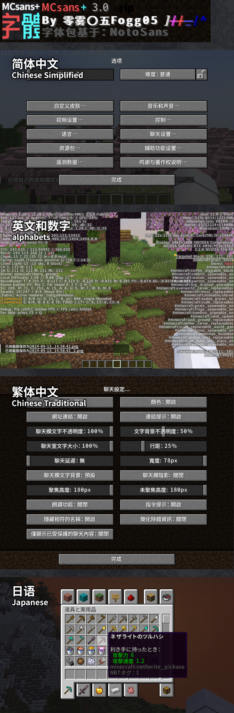

# MCsans+

### Replace the pixel-style Vanilla font with MiSans, mainly for Chinese players.

Changed Chinese characters, English alphabets, Japanese, and commonly used symbols.

---

# MCsans+

### 用高清的MiSans字体替换了原版的像素风字体，包含中文汉字、英文字母、日语和常用符号。

⒈ 和装载普通的材质包一样使用，装上就能呈现高清字体。😎

⒉ 作品基于原版框架，不依赖任何前置mod，装上就能用。

⒊ 适配的游戏版本：≥ 1.20.0 😴

⒋ 材质包叫做“MCsans+”，使用了“MiSans”字体。

### 如果喜欢 🥰 我的作品，🙏 请务必在网页右上角 ↗️ 给这个项目点颗星星 ⭐Star 感谢您的支持！！！🤩🤩🤩

作者Ｂ站：https://space.bilibili.com/350715147

作者网名：零雾〇五Fogg05

# 

---

Unlike Chinese characters, which every one shares a same square outline with each character, each alphabets has a different width. I need to set the width of each alphabets, manually, to make it correctly showcases with the spacing between alphabets. Therefore, I can't cover the languages that I'm not familiar with. Meanwhile, the alphabets are in 8px, and Mojang's special design good enough, which is different from Chinese characters in 16px making their brush-strokes extremely thin and hard to read. This is the reason why I haven't modified many alphabets.🥲🥲🥲

不同于中文的方块字，字母有着不同的宽度。这使得我需要手动调节每个字母的宽度，才能够让它们的间距正常。所以我没有能力修改我不熟悉的语言。同时，由于Mojang的专门设计，字母的显示也已经足够优秀，所以我没有覆盖各种拉丁字母。🥲🥲🥲

---
